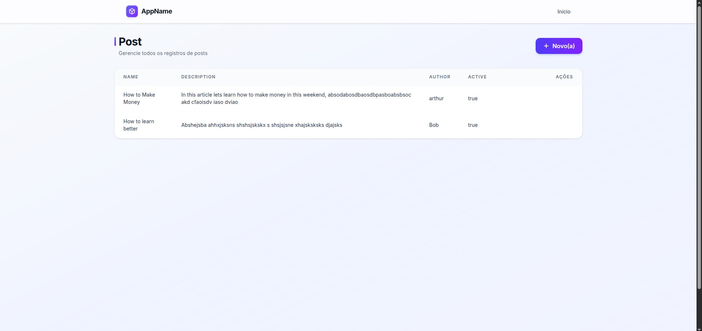
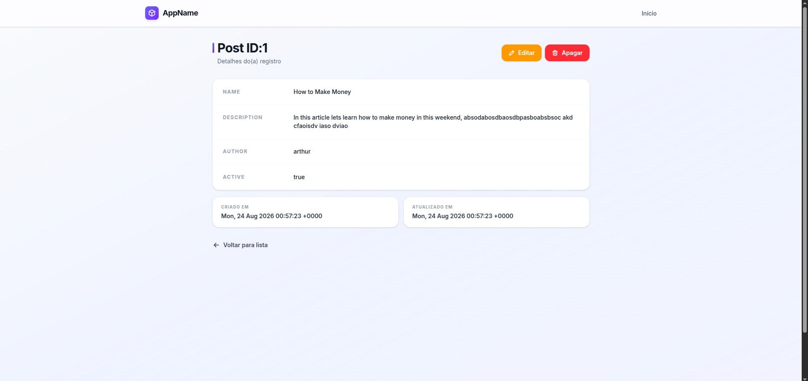
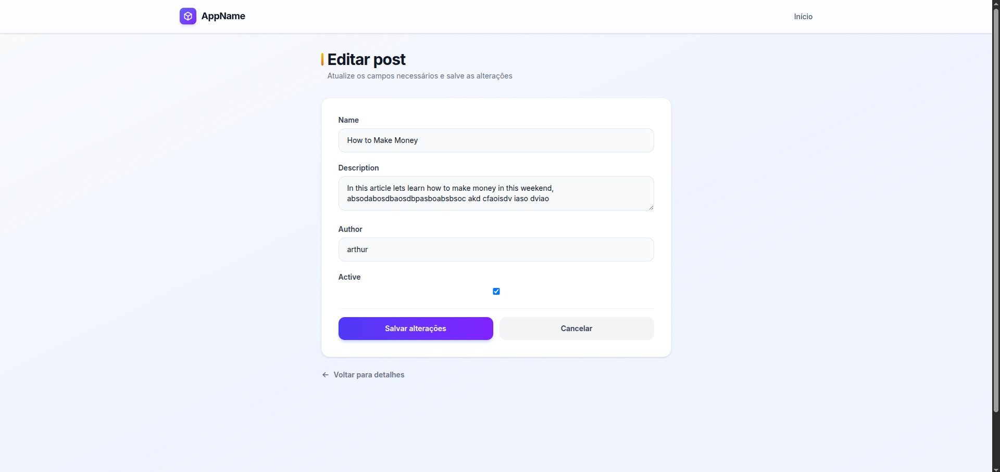
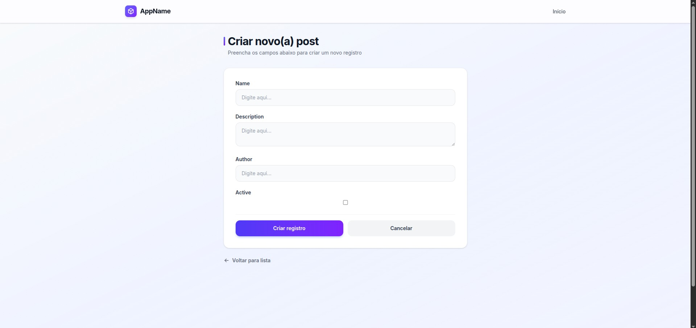

# 🎨 Rails 8 Scaffold Template com Tailwind CSS

Bem-vindo ao **Rails 8 Scaffold Template com Tailwind CSS**! Este é um template pronto para uso que substitui a interface padrão gerada pelo comando `rails generate scaffold` do Ruby on Rails. Ele traz uma abordagem moderna, focada em design mobile-first, acessibilidade e ótima experiência do usuário (UX), integrando-se perfeitamente ao Tailwind CSS.

---

## 🚀 O que é este projeto?

Quando você roda um gerador de scaffold no Rails (`rails generate scaffold Post title:string`), ele cria as *views* (arquivos HTML) utilizando templates padrão que costumam ser bem básicos e sem estilização. 

Este projeto resolve isso ao **sobrescrever esses templates padrão**. Ao clonar e usar este template no seu projeto Rails, todos os scaffolds gerados automaticamente já virão com:
- Um design premium estilizado com Tailwind CSS.
- Tabelas responsivas (tabelas completas em desktop, cards adaptáveis no mobile).
- Formulários elegantes com feedback visual (focus rings coloridos) inteligentes e adaptados ao tipo de dado.
- Alertas e mensagens de erro bonitos.
- "Empty States" amigáveis (quando não há registros no banco de dados).
- Ícones em SVG inline profissionais (via [Tabler Icons](https://github.com/tabler/tabler-icons)), sem a necessidade de emojis básicos.
- **Bônus:** Um layout base completo (`application.html.erb` e `_flash.html.erb`) contendo Navbar responsiva e sistema de Toasts para os avisos do Rails!

Tudo isso, **sem adicionar nenhuma dependência JavaScript extra**. Todo o layout é baseado em utilitários do Tailwind!

---

## 🛠 Stack Utilizada

- **Framework:** Ruby on Rails 8
- **Estilização:** Tailwind CSS (via `tailwindcss-rails`)
- **Ícones:** SVG Inline ([Tabler Icons](https://tabler-icons.io/))
- **Templates:** ERB (`lib/templates/erb/scaffold/`)

---

## 📸 Imagens de Demonstração (Screenshots)

*(Adicione suas screenshots abaixo)*

### Index (Mobile)


### Show (Mobile)


### Edit (Mobile)


### New (Mobile)


### Index (Desktop)


### Show (Desktop)


### Edit (Desktop)


### New (Desktop)


---

## ⚙️ Como Instalar e Utilizar

A ideia principal é que você possa copiar a estrutura deste repositório e colar diretamente dentro de qualquer novo projeto Rails 8 seu.

1. **Clone este repositório:**
   ```bash
   git clone https://github.com/arthun01/scaffold-template-tailwind.git
   ```
   
2. **Copie a pasta `lib/templates` para o seu projeto Rails:**
   Dentro da raiz do seu projeto Rails (que precisa estar configurado com Tailwind), certifique-se de que a estrutura a seguir existe:
   ```text
   meu-projeto-rails/
   └── lib/
       └── templates/
           └── erb/
               └── scaffold/
                   ├── _form.html.erb
                   ├── edit.html.erb
                   ├── index.html.erb
                   ├── new.html.erb
                   └── show.html.erb
   ```

3. **(Opcional) Utilize o Layout Base e Flashes:**
   Para garantir que as Views do Scaffold fiquem com a aparência ideal, você pode copiar a estrutura principal que deixamos na pasta `base_layout/`:
   - Copie `base_layout/application.html.erb` para `app/views/layouts/application.html.erb` (Layout com Navbar e Fundo já estilizado).
   - Copie `base_layout/_flash.html.erb` para `app/views/layouts/_flash.html.erb` (Notificações em Toasts bonitos!).

4. **Pronto!** O Rails automaticamente vai passar a ler esses arquivos toda vez que você gerar um novo scaffold. Não é necessária nenhuma outra configuração extra.

---

## 📖 Como Usar no Dia a Dia

Você não precisa mudar nada na forma como você trabalha com o Rails. Os templates criados na pasta `lib/templates/` são lidos automaticamente de maneira silenciosa.

### 1. Criando um Novo Recurso (Scaffold)
Basta rodar o comando padrão do Rails. Por exemplo, criando um painel para Produtos:

```bash
bin/rails generate scaffold Product name:string description:text price:decimal active:boolean
```

**O que vai acontecer?** O Rails vai gerar os models, controllers e rotas padrão. Porém, ao gerar os arquivos `.html.erb`, ele usará nossos templates e criará páginas belíssimas, usando paletas de cores padrão, prontas para ir à produção.

Não esqueça de rodar as migrações:
```bash
bin/rails db:migrate
```

### 2. Substituindo um Scaffold Antigo
Se você já tinha um projeto existente com scaffolds antigos, pode forçar o Rails a regenerar apenas as views rodando o mesmo comando com a flag `--force`:

```bash
bin/rails generate scaffold Product name:string description:text price:decimal active:boolean --force
```
*(Cuidado: a flag `--force` reescreve os arquivos originais e isso removerá lógicas customizadas inseridas anteriormente nas Views ou Controllers)*

---

## 📦 O que este template cobre (e o que não cobre)

Este template tem um **escopo intencional e bem definido**: melhorar a aparência do CRUD gerado pelo scaffold. Ele **não é** um starter kit completo.

### ✅ Incluso

| Feature | Descrição |
|---|---|
| `index` | Tabela responsiva (desktop) + cards (mobile) + empty state |
| `show` | Página de detalhes com layout limpo |
| `new` / `edit` | Páginas de formulário estilizadas |
| `_form` | Formulário inteligente adaptado ao tipo de dado |
| `application.html.erb` | Layout base com Navbar glassmorphism e Inter font |
| `_flash.html.erb` | Toast notifications animadas para avisos do Rails |

### ❌ Fora do escopo

| Feature | Por quê não está aqui |
|---|---|
| 🔍 **Filtros e buscas** | Depende de gems como `Ransack` e lógica customizada no controller |
| 📄 **Paginação** | Requer `Kaminari` ou `Pagy` — configuração específica de cada projeto |
| 🔐 **Login / Autenticação** | Depende de `Devise` ou do Authentication Concern nativo do Rails 8 |
| 📊 **Dashboard / gráficos** | Lógica e dados específicos de cada aplicação |
| 🛡️ **Permissões / Roles** | Requer `CanCanCan`, `Pundit` ou solução customizada |

> **Resumindo:** rode `rails generate scaffold`, copie os templates e já terá um CRUD bonito e pronto. Para funcionalidades extras, você as adiciona normalmente sobre essa base estilizada.

---

## 🎨 Helpers Globais Opcionais

Para aproveitar ao máximo o layout e manter a consistência fora do scaffold, recomendamos adicionar esses métodos ao seu arquivo `app/helpers/application_helper.rb`. Eles permitem que você utilize rapidamente Badges de status:

```ruby
module ApplicationHelper
  def badge_success(text)
    content_tag :span, text, class: "inline-block px-3 py-1 text-xs font-semibold rounded-full bg-emerald-100 text-emerald-800"
  end

  def badge_warning(text)
    content_tag :span, text, class: "inline-block px-3 py-1 text-xs font-semibold rounded-full bg-amber-100 text-amber-800"
  end

  def badge_danger(text)
    content_tag :span, text, class: "inline-block px-3 py-1 text-xs font-semibold rounded-full bg-red-100 text-red-800"
  end
end
```

---

## 👨‍💻 Autor

Criado e mantido por **Arthur Ramos Vieira**

Sinta-se à vontade para fazer um fork, mandar pull requests ou abrir issues. Aproveite para agilizar a criação dos seus próximos MVPs e sistemas internos usando a potência e a beleza do **Rails + Tailwind**!
